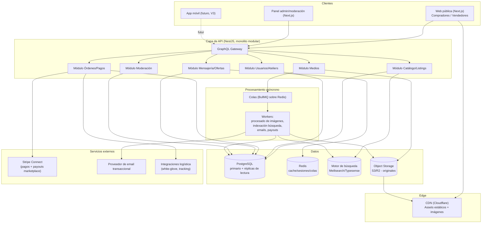
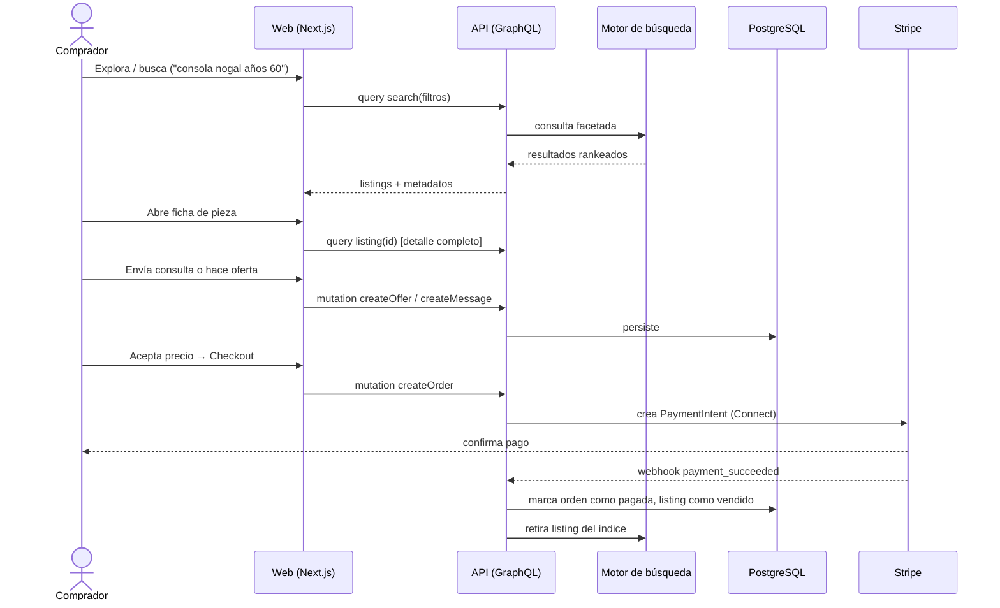
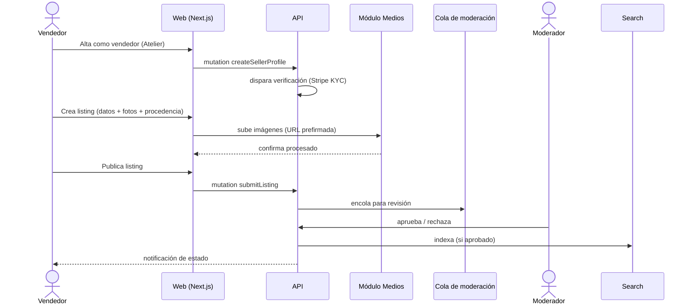

# ARCHITECTURE.md — Nogal

## 1. Visión general

Nogal es un marketplace vertical especializado en mobiliario de alta calidad, diseño de autor, antigüedades y piezas de colección. No es un e-commerce genérico: cada pieza es única o de tirada limitada, el valor depende de procedencia (_provenance_), estado de conservación, autenticidad y contexto histórico/de diseño, y las transacciones suelen ser de alto valor y baja frecuencia por usuario.

Estas características condicionan toda la arquitectura:

- El **catálogo** no es de SKUs intercambiables, sino de piezas únicas con metadatos ricos (época, material, dimensiones, procedencia, condición).
- La **fotografía** es el activo más importante del producto: la infraestructura de medios debe tratarse como un sistema de primera clase, no como un adjunto.
- Las **transacciones** requieren confianza (verificación de vendedores, documentación de autenticidad, mediación de disputas), no solo un checkout.
- El **SEO y la indexación** son críticos: gran parte del descubrimiento vendrá de búsqueda orgánica sobre piezas específicas ("silla Wegner CH24 años 50"), no solo de navegación interna.
- El crecimiento se mide en **cientos de miles de usuarios**, pero el volumen de transacciones por pieza es bajo (no es alto QPS de carrito, es alto QPS de lectura/exploración).

Estas cuatro observaciones son las que gobiernan cada decisión tecnológica de este documento.

## 2. Principios arquitectónicos

1. **Monolito modular antes que microservicios.** Con el equipo y la escala inicial, una arquitectura de microservicios añade complejidad operativa (observabilidad distribuida, consistencia eventual, despliegues coordinados) sin beneficio real. Se diseña un **monolito modular** con límites de dominio claros (bounded contexts) para poder extraer servicios concretos (búsqueda, medios, pagos, notificaciones) cuando la escala o el equipo lo justifiquen.
2. **Lectura optimizada, escritura correcta.** El 95%+ del tráfico será navegación/búsqueda/lectura de fichas de producto. Se optimiza agresivamente esa vía (cache, CDN, SSR/ISR, índices de búsqueda) mientras que las rutas de escritura (crear listing, pagar, mensajear) priorizan corrección e integridad transaccional sobre latencia extrema.
3. **Los medios son un subsistema, no un campo de base de datos.** Subida, procesamiento, versiones responsivas, protección de derechos y entrega por CDN se tratan como una pipeline independiente.
4. **Confianza como feature de producto, no como capa de moderación añadida.** Verificación de vendedores, trazabilidad de procedencia y moderación de contenido están en el núcleo del dominio, no como un módulo periférico.
5. **Tipado estricto de extremo a extremo.** TypeScript estricto en frontend y backend, contrato de API tipado compartido (ver §4.3), para sostener el proyecto con mantenibilidad durante años y equipos que rotan.
6. **Preparado para extraer, no para fragmentar.** Cada módulo del monolito se diseña con límites claros (su propio esquema lógico, sus propios casos de uso) para que extraerlo a un servicio independiente sea un ejercicio de infraestructura, no una reescritura.

## 3. Arquitectura general

## 4. Stack tecnológico y justificación

### 4.1 Frontend

| Decisión                                                            | Justificación                                                                                                                                                                                                                                                                                                                                    |
| ------------------------------------------------------------------- | ------------------------------------------------------------------------------------------------------------------------------------------------------------------------------------------------------------------------------------------------------------------------------------------------------------------------------------------------ |
| **Next.js (App Router) + React + TypeScript estricto**              | SEO es crítico para el descubrimiento de piezas únicas: se necesita SSR/SSG/ISR real, no una SPA pura. App Router permite layouts anidados (galería + ficha + panel de vendedor) sin recargar la identidad visual, y React Server Components reducen el JS enviado al cliente en páginas dominadas por imágenes.                                 |
| **Tailwind CSS como capa de utilidades, no como sistema de diseño** | Tailwind por sí solo produce el aspecto "SaaS genérico" que el proyecto quiere evitar explícitamente. Se usa únicamente como motor de utilidades de bajo nivel (espaciado, grid) sobre un **sistema de diseño propio** (ver DESIGN_PRINCIPLES.md) con tokens de marca (paleta, tipografía editorial, ritmo vertical) definidos en `packages/ui`. |
| **Radix UI (primitivos headless) para interacción accesible**       | Menús, diálogos, tooltips y comboboxes accesibles (teclado, ARIA) sin heredar ningún estilo visual predeterminado — evita el "look" de librerías de componentes preestilizadas (Material, Chakra, Ant) que inmediatamente delatan un producto genérico.                                                                                          |
| **next/image + pipeline de imágenes responsivas**                   | La fotografía es el producto. Se requieren tamaños responsivos, lazy loading real, y formatos modernos (AVIF/WebP) sin sacrificar nitidez en pantallas grandes (la experiencia debe soportar zoom/detalle en piezas de colección).                                                                                                               |

### 4.2 Backend

| Decisión                                                | Justificación                                                                                                                                                                                                                                                                                                                                                                                                                                                                                                                                                                         |
| ------------------------------------------------------- | ------------------------------------------------------------------------------------------------------------------------------------------------------------------------------------------------------------------------------------------------------------------------------------------------------------------------------------------------------------------------------------------------------------------------------------------------------------------------------------------------------------------------------------------------------------------------------------- |
| **NestJS (Node.js + TypeScript) como monolito modular** | NestJS impone estructura (módulos, inyección de dependencias, guards, interceptores) que escala bien con el tamaño del equipo y del dominio a lo largo de años, evitando el caos de un Express desestructurado. Los módulos de dominio (Catálogo, Usuarios, Órdenes, Mensajería, Moderación, Medios) están aislados internamente, lo que permite extraerlos como servicios independientes cuando la carga lo requiera, sin reescritura.                                                                                                                                               |
| **GraphQL (Apollo sobre NestJS) como API pública**      | El catálogo tiene datos profundamente anidados y de peso variable (ficha completa vs. tarjeta de listado vs. vista de comparación). GraphQL permite a cada cliente (web, admin, futura app móvil) pedir exactamente los campos necesarios, reduciendo payload en páginas cargadas de imágenes y evitando explosión de endpoints REST a medida que el dominio crece. El esquema tipado se comparte vía codegen con el frontend, reforzando el tipado estricto de extremo a extremo. Webhooks de terceros (Stripe) se atienden por endpoints REST puntuales, no por el gateway GraphQL. |
| **Prisma ORM sobre PostgreSQL**                         | Migraciones versionadas, tipado generado automáticamente a partir del esquema, y queries seguras en tiempo de compilación. Reduce errores de integridad en un dominio con muchas relaciones (listing–vendedor–medios–procedencia–orden).                                                                                                                                                                                                                                                                                                                                              |

### 4.3 Base de datos y almacenamiento

| Decisión                                                      | Justificación                                                                                                                                                                                                                                                                                                                                                                                                                                                                                                                     |
| ------------------------------------------------------------- | --------------------------------------------------------------------------------------------------------------------------------------------------------------------------------------------------------------------------------------------------------------------------------------------------------------------------------------------------------------------------------------------------------------------------------------------------------------------------------------------------------------------------------- |
| **PostgreSQL como base de datos primaria**                    | El dominio es fuertemente relacional (usuarios, listings, órdenes, pagos, reseñas) y requiere integridad transaccional real (una pieza no puede venderse dos veces, un pago no puede quedar huérfano de una orden). PostgreSQL además soporta JSONB para atributos semi-estructurados (dimensiones, metadatos de procedencia) sin perder las garantías relacionales del resto del esquema.                                                                                                                                        |
| **Réplicas de lectura**                                       | Dado que el tráfico es mayoritariamente de lectura (exploración/búsqueda), las réplicas descargan el primario y permiten escalar lectura horizontalmente sin tocar el modelo de datos.                                                                                                                                                                                                                                                                                                                                            |
| **Meilisearch o Typesense para búsqueda y filtrado facetado** | La búsqueda de un marketplace de este tipo necesita filtros combinados (categoría, material, época, rango de precio, dimensiones, vendedor) con tolerancia a errores tipográficos y ranking de relevancia — algo que PostgreSQL full-text no resuelve bien a esta escala. Se prefiere Meilisearch/Typesense (open-source, autoalojable, coste predecible) sobre Algolia por control de coste a largo plazo; Algolia queda como alternativa si la relevancia out-of-the-box justifica el coste una vez haya tráfico significativo. |
| **Object Storage (S3 o Cloudflare R2) + CDN (Cloudflare)**    | Los originales de imagen se almacenan en object storage; nunca en la base de datos ni en disco del servidor de aplicación. R2 se prefiere a S3 si el volumen de salida (egress) es alto, por su modelo de coste sin cargos de egress.                                                                                                                                                                                                                                                                                             |
| **Redis**                                                     | Cache de queries calientes (fichas de producto más vistas, resultados de búsqueda frecuentes), gestión de sesiones y backend de colas (BullMQ).                                                                                                                                                                                                                                                                                                                                                                                   |

### 4.4 Medios (subsistema crítico)

Pipeline dedicada, no un simple upload:

1. Subida directa del cliente a object storage vía URL prefirmada (evita saturar el servidor de aplicación con binarios).
2. Un worker asíncrono genera automáticamente: variantes responsivas (múltiples anchos), formato moderno (AVIF/WebP con fallback), thumbnail, y una versión de alta resolución para "modo detalle/zoom" (relevante en antigüedades donde el comprador necesita inspeccionar el estado de conservación).
3. Metadatos EXIF sensibles se limpian; se conserva orden de la galería y texto alternativo (accesibilidad + SEO de imágenes).
4. Entrega final siempre vía CDN, nunca directo desde el object storage.

### 4.5 Pagos y flujo económico marketplace

| Decisión                                                                             | Justificación                                                                                                                                                                                                                                                                                                                                                                                                                                                        |
| ------------------------------------------------------------------------------------ | -------------------------------------------------------------------------------------------------------------------------------------------------------------------------------------------------------------------------------------------------------------------------------------------------------------------------------------------------------------------------------------------------------------------------------------------------------------------- |
| **Stripe Connect (modelo "destination charges" o "separate charges and transfers")** | Es la única opción madura para un marketplace real: retiene el pago del comprador, permite descontar la comisión de la plataforma, verifica a los vendedores (KYC) para cumplir regulación financiera, y ejecuta el payout al vendedor cuando se cumplen las condiciones de la orden (p. ej. confirmación de entrega). Construir esto a mano (custodiar fondos, cumplir KYC/AML) es un riesgo legal y de seguridad que ninguna startup debería asumir por su cuenta. |

### 4.6 Mensajería y notificaciones

- **Conversaciones comprador–vendedor** (consultas, negociación de precio): en el MVP, basta con persistencia en PostgreSQL + polling/refetch; no se requiere WebSocket desde el día uno. Se documenta como extensión natural (Redis pub/sub + WebSocket gateway de NestJS) para V2 cuando el volumen de mensajería lo justifique.
- **Notificaciones** (nueva oferta, mensaje, pieza vendida, favorito con bajada de precio): cola asíncrona (BullMQ) que despacha email transaccional y, en el futuro, push.

### 4.7 Infraestructura y despliegue

| Decisión                                                                                         | Justificación                                                                                                                                                                                                                                                                                                                                                                                                                                                               |
| ------------------------------------------------------------------------------------------------ | --------------------------------------------------------------------------------------------------------------------------------------------------------------------------------------------------------------------------------------------------------------------------------------------------------------------------------------------------------------------------------------------------------------------------------------------------------------------------- |
| **Frontend (Next.js) en Vercel**                                                                 | Edge network global, optimización de imágenes integrada, preview deployments automáticos por PR — encaja directamente con la prioridad de rendimiento de imágenes y con un flujo de revisión de diseño ágil (crítico en un producto donde el detalle visual es la propuesta de valor).                                                                                                                                                                                      |
| **Backend (NestJS) en contenedores sobre AWS (ECS Fargate) o Render/Railway en fases tempranas** | Contenedores dan control total sobre el runtime (necesario para workers de procesamiento de imágenes con librerías nativas) sin la rigidez de funciones serverless para procesos largos o con estado (WebSocket). Se recomienda empezar en Render/Railway (velocidad de iteración, coste bajo) y migrar a AWS ECS + RDS + ElastiCache cuando el volumen lo justifique; el contrato Docker es el mismo en ambos casos, por lo que la migración es operativa, no de rediseño. |
| **Infraestructura como código (Terraform)** desde el momento en que se migre a AWS               | Reproducibilidad de entornos (staging/producción) y auditoría de cambios de infraestructura.                                                                                                                                                                                                                                                                                                                                                                                |
| **GitHub Actions para CI/CD**                                                                    | Lint, type-check, tests, build y despliegue automatizado en cada PR; despliegues a producción solo desde `main` tras pasar el pipeline completo.                                                                                                                                                                                                                                                                                                                            |

### 4.8 Observabilidad

- **Sentry** para errores de frontend y backend.
- **OpenTelemetry** instrumentando la API, exportando a un backend de métricas/trazas (Grafana Cloud o Datadog según presupuesto).
- **Logging estructurado (JSON)** en todos los servicios, correlacionado por `requestId`.

### 4.9 Testing

- **Vitest** para unidad (frontend y backend).
- **Testing Library** para componentes.
- **Playwright** para end-to-end de los flujos críticos (publicar listing, comprar, mensajear, moderar).
- **Chromatic o Percy** para regresión visual — justificado específicamente porque el valor del producto es visual/editorial: un cambio de CSS que rompa el ritmo tipográfico o el aspect ratio de las imágenes es un bug tan grave como uno funcional.

## 5. Alternativas consideradas y descartadas

- **Plataforma de e-commerce genérica (Shopify, Medusa "as-is")**: descartada. Estas plataformas asumen catálogo de SKUs repetibles y checkout estándar; no modelan bien piezas únicas, procedencia, verificación de vendedores ni negociación de precio. Se construye a medida sobre PostgreSQL/NestJS en su lugar.
- **Microservicios desde el día uno**: descartado por sobreingeniería prematura; el monolito modular cubre la necesidad y se diseña explícitamente para partirse cuando haga falta (§2.1).
- **Backend 100% serverless (Lambda/Cloud Functions)**: descartado como arquitectura por defecto porque el procesamiento de imágenes y una futura capa de mensajería en tiempo real encajan mal con límites de duración/estado de las funciones. Se mantiene abierto el uso puntual de funciones edge para tareas específicas (p. ej. transformaciones de imagen ligeras).
- **REST puro en lugar de GraphQL**: descartado como API principal por la necesidad de payloads variables entre vista de listado, ficha de detalle y panel de vendedor; se mantiene REST solo para webhooks de terceros.
- **Firebase/Supabase "todo en uno"**: descartado porque el dominio necesita lógica transaccional compleja (comisiones, payouts, moderación) que se modela mejor en un backend propio con reglas de negocio explícitas, no en reglas declarativas de una BaaS.

## 6. Flujo completo del sistema

### 6.1 Comprador

### 6.2 Vendedor

### 6.3 Moderación y confianza

Todo listing nuevo, todo vendedor nuevo y todo contenido reportado pasa por el **módulo de moderación** antes de ser visible públicamente o de continuar operando (ver BUSINESS_RULES.md para las reglas exactas). Este módulo es de primera clase en el dominio, no un panel añadido después.

## 7. Seguridad (resumen; detalle en desarrollo posterior)

- Autenticación con JWT de vida corta + refresh token rotativo, almacenado en cookie `httpOnly`/`secure`.
- Autorización basada en roles y en propiedad de recursos (un vendedor solo puede editar sus propios listings) mediante guards de NestJS.
- Verificación de identidad (KYC) delegada en Stripe Identity/Connect, nunca gestionada con datos sensibles propios.
- Rate limiting por IP/usuario en mutaciones sensibles (mensajería, ofertas, creación de cuentas).
- Todo dato de pago vive en Stripe; la base de datos propia nunca almacena números de tarjeta.

## 8. Resumen de decisiones clave

| Área           | Decisión                                                     |
| -------------- | ------------------------------------------------------------ |
| Frontend       | Next.js + TypeScript + Tailwind (solo utilidades) + Radix UI |
| Backend        | NestJS monolito modular + GraphQL                            |
| Base de datos  | PostgreSQL + Prisma + réplicas de lectura                    |
| Búsqueda       | Meilisearch/Typesense                                        |
| Medios         | S3/R2 + pipeline de procesamiento + Cloudflare CDN           |
| Pagos          | Stripe Connect                                               |
| Cache/Colas    | Redis + BullMQ                                               |
| Infra          | Vercel (frontend) + contenedores (backend) + Terraform       |
| Observabilidad | Sentry + OpenTelemetry                                       |
| Testing        | Vitest + Playwright + Chromatic                              |
