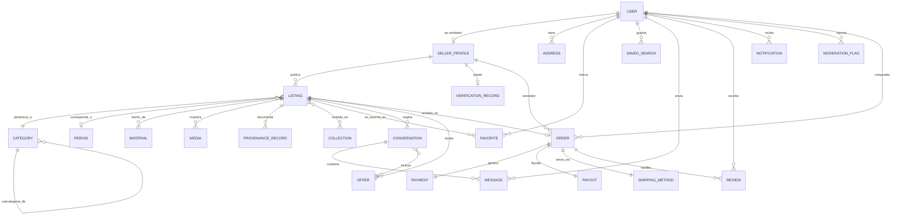

# DATABASE_OVERVIEW.md — Nogal

Modelo conceptual de datos. Motor: **PostgreSQL**, gestionado vía **Prisma**. Este documento describe entidades y relaciones a nivel conceptual; el esquema exacto de columnas se define en `packages/database/schema.prisma` durante la implementación.

## 1. Entidades principales

### Identidad y vendedores

- **User** — cuenta base (comprador, vendedor, moderador o administrador). Un usuario puede ser comprador y vendedor a la vez.
- **SellerProfile (Atelier)** — perfil público de vendedor/galería: nombre comercial, biografía, especialidades, nivel de verificación, cuenta de payout (Stripe Connect).
- **Address** — direcciones de envío/facturación asociadas a un usuario.

### Catálogo

- **Listing (Pieza)** — la entidad central: una pieza única en venta. Incluye título, descripción, dimensiones, condición, precio, tipo de precio (fijo/oferta), estado del ciclo de vida.
- **Category** — taxonomía jerárquica (p. ej. Mobiliario > Asientos > Sillones).
- **Material** — taxonomía de materiales (madera de nogal, cuero, latón...), relación N:N con Listing.
- **Period** — época o corriente de diseño (Art Déco, Mid-Century, Bauhaus...), usada como filtro y como campo del listing.
- **Media** — imágenes/vídeos asociados a un listing, con orden, texto alternativo y variantes.
- **ProvenanceRecord** — documentación de procedencia/autenticidad de una pieza (historial de propietarios, certificados, tasaciones).
- **Collection** — agrupación editorial curada de listings (p. ej. "Diseño escandinavo de los 60"), N:N con Listing.

### Interacción comercial

- **Favorite** — relación N:N entre User y Listing (lista de deseos).
- **SavedSearch** — filtros de búsqueda guardados por un usuario, con opción de alerta.
- **Conversation** — hilo de mensajería entre comprador y vendedor, anclado a un listing.
- **Message** — mensaje individual dentro de una conversación.
- **Offer** — oferta de precio de un comprador sobre un listing, con estado (pendiente, aceptada, rechazada, contraofertada, expirada).

### Transacción

- **Order** — orden de compra sobre un listing concreto (relación 1:1 con Listing una vez vendido).
- **Payment** — registro del pago asociado a una orden (referencia al PaymentIntent de Stripe).
- **Payout** — liquidación al vendedor asociada a una orden.
- **ShippingMethod** — método de envío/entrega de una orden (estándar o white-glove), con tracking.
- **Review** — valoración bidireccional post-transacción (comprador→vendedor y vendedor→comprador).

### Confianza y moderación

- **ModerationFlag** — reporte o marca sobre un listing o usuario, con motivo, estado y resolución.
- **VerificationRecord** — estado de verificación de identidad/KYC de un vendedor (referencia a Stripe Identity).

### Sistema

- **Notification** — notificaciones dirigidas a un usuario (nuevo mensaje, oferta, cambio de estado de orden...).

## 2. Relaciones principales

- Un `User` tiene como máximo un `SellerProfile` (1:0..1).
- Un `SellerProfile` publica muchos `Listing` (1:N).
- Un `Listing` pertenece a una `Category` (N:1), tiene muchos `Material` (N:N) y opcionalmente un `Period` (N:1).
- Un `Listing` tiene muchos `Media` (1:N, ordenados) y muchos `ProvenanceRecord` (1:N).
- Un `Listing` puede pertenecer a muchas `Collection` (N:N).
- Un `User` puede marcar como favoritos muchos `Listing` (N:N vía `Favorite`).
- Un `Listing` puede tener muchas `Conversation` (1:N), cada una con muchos `Message` (1:N) y opcionalmente `Offer` asociadas (1:N).
- Un `Listing` da lugar como máximo a una `Order` (1:0..1, porque la pieza es única y se vende una sola vez).
- Una `Order` tiene un `Payment` (1:1), un `Payout` (1:1) y un `ShippingMethod` (1:1).
- Una `Order` completada habilita hasta dos `Review` (comprador↔vendedor).
- Un `ModerationFlag` referencia opcionalmente a un `Listing` o a un `User` (reporte sobre contenido o sobre una cuenta).

## 3. Diagrama entidad-relación (modelo conceptual)

## 4. Notas de diseño del modelo

- **Unicidad de la pieza**: a diferencia de un e-commerce tradicional, `Listing` no tiene concepto de stock/cantidad más allá de 1. Esto simplifica el modelo de `Order` (1:1 con `Listing`) pero exige bloqueo optimista al momento de la compra para evitar que dos compradores paguen simultáneamente por la misma pieza.
- **Procedencia como entidad propia (`ProvenanceRecord`)** y no como campo de texto en `Listing`: permite múltiples registros verificables (documento, verificador, fecha) por pieza, necesario tanto para la confianza del comprador como para futuras funciones de tasación/autenticación (ver ROADMAP.md).
- **Taxonomías (`Category`, `Material`, `Period`) como tablas propias**, no como enums en código: deben poder crecer y traducirse (i18n) sin desplegar código nuevo, y alimentan directamente las facetas del motor de búsqueda.
- **`Review` bidireccional**: en un marketplace de confianza, la reputación del comprador importa tanto como la del vendedor (impago, cancelaciones), por lo que el modelo permite valorar en ambos sentidos, no solo vendedor→visible.
- **Reindexación desacoplada**: el motor de búsqueda (Meilisearch/Typesense) no es la fuente de verdad; se resincroniza de forma asíncrona a partir de PostgreSQL vía cola, por lo que el ER anterior representa exclusivamente el estado transaccional, no el índice de búsqueda.
